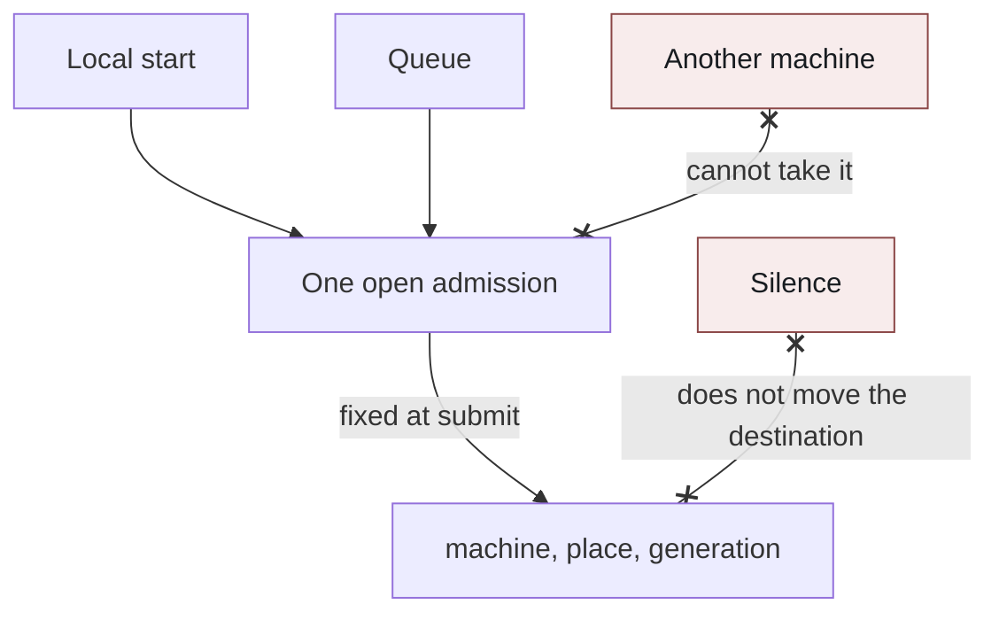
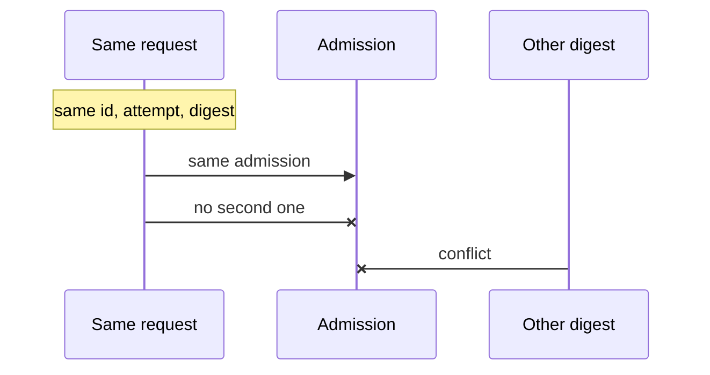

# One Open Admission While a Start Is Unfinished

If there is one entrance for starting work, there is no question of where an intention lands. They split when an entrance that starts from the local side, an entrance that enqueues, and an entrance that appends the next input to work already open, all exist at once. If each one chooses the destination itself, the same intention lands on different machines. A resend whose response never arrived becomes a second execution. When a machine is silent, it is tempting to move the work to another machine that is free. The place it moves to does not have the context that was left behind.

In this design, an unfinished admission to start is one per workspace surface that uses the same place. The destination is written onto the admission at submit time, and it is not moved to another machine while the first is silent.

## The problem

The trouble starts when there are several entrances before a start has become the fact "it ran."

A local action tries to start on the machine the person is looking at. A queue tries to deliver to the machine that was visible when it was enqueued. If an old pickup path is still around, it tries to become the owner of the same work. If the three succeed separately, one workspace surface has two executions. Files split, and so does the continuation of the work.

When a response drops, the caller retries the same start. If the server admitted the first one and only the response was lost, the retry looks like a new start. Without remembering the admission, a second one is issued. Even with a memory, accepting a request with different contents under the same identifier cannot tell a resend of the previous admission from a different intention.

Deciding the destination when something comes to pick the work up is weak against silence. Whichever live machine picks it up wins. The machine a person chose and the machine that actually ran are different. Silence is not the same as that machine being dead. Sleeping, or a stopped network, look like the same quiet from the outside. Move because of that quiet, and the work on the machine that comes back and the work on the machine it was moved to both remain.

One admission per person stops work in an unrelated place. One admission per machine means two pieces of work that use the same directory do not see each other. Get the unit wrong, and there are too many refusals, or there are two owners.

Placement still changes after an admission. The location changes, and which work it belongs to changes. Rewrite the destination of an open admission in place, and the side that is running stays on the old place while only the admission names the new one. They were lined up silently, and neither remains as the truth.

Delete the admission when the machine's row is deleted, and the record of an uncertain execution disappears. The same request arriving late treats the first as if it never existed, and obtains a second admission.

Cutting an attached credential on a short deadline, and releasing the owner of the workspace surface, are different operations. Look only at the deadline, and another machine can come and take the same surface from a machine whose attached credential has expired.

## Constraints

The constraints in this design are as follows.

An unfinished admission to start can be placed only one per workspace surface. A finished admission remains as history, and it does not block the next start. An open admission always has a machine and a place. An open admission with no place cannot be created.

The same request identifier, the same attempt, and the same digest of the contents are a resend of the same admission. Different contents are a conflict, not a new admission. A resend whose response was dropped does not add an owner. On a resend, the evaluation of what is allowed is done again. A remaining admission row is not a substitute for the permission still being valid.

The destination is the placement at submit time. The machine, the place, and the generation of that placement are written on the admission. If the placement has changed by the time of the start, it is refused. The destination of an open admission is not rewritten onto another machine.

Silence is not a condition for moving. An attached credential may expire quickly. Even if it expires, the owner of the workspace surface is not released. It is released only when the start has been recorded as finished. An unexecuted request that does not arrive for a long time is not handed to another machine. It remains as expired. Anything older than half a day expires when that machine next comes to pick it up.

A queue row names its destination when it is enqueued. Pickup checks only that the destination is the machine that is picking up now. It does not look for a free machine.

While an old pickup path remains, the same work's row is locked, so that on a surface with an unfinished admission the old path cannot become the owner. Neither path may name itself the owner without waiting for the other to settle.

A person's input stays local until the admission is accepted. A refused input remains as something that was not sent.

Deleting a machine row or a work row does not delete an uncertain admission. Delete it, and a late request obtains a second one.

## Approaches this design rejects

### Starting at each entrance

The local side opens an execution locally, the queue opens one on the machine that picked it up, and a send into work already open opens one at the far end of that connection. Each remembers its own success, and the server reconciles later. Before the reconciliation, the same intention starts writing files in two places.

Making the entrance one on the sequence of operations does the same thing if another path remains. One admission to start is not a constraint on the sequence of operations. It is that only one unfinished row can be placed.

### Deciding the destination at pickup

Not writing a machine when enqueueing, and choosing among the machines that come to pick it up. A live machine wins. A silent machine is not chosen. The place a person was looking at and the place the execution ran are different. If pickup owns the choice of path, the rule of the choice and the destination a person pinned become different truths.

In this design, pickup does not choose. If the destination written on the row is not the machine that came to pick it up, that machine cannot take it.

### Treating silence as expiry and freeing the surface

Releasing the owner of the workspace surface when the attached credential expires. A slow machine and a dead machine look the same from the outside. The moment it is released, another machine obtains an admission, and the continuation on the machine that comes back and the start on the new machine both exist.

The attached credential is short so that the authority handed to an execution is not held for long. Releasing the owner is done only by the record that the start finished. An unexecuted item that nobody picks up for more than half a day is expiry, not a move. Expiry remains as a fact on that machine.

### One admission per person

Limiting a person to one piece of work they can start at a time. Work in an unrelated place stops too. The other way, one per machine, and pieces of work that use the same directory do not see each other.

What this design made one is the workspace surface whose execution uses the same place. Another piece of work that is allowed to use the same place splits the surface key. Forget to split it, and a start the policy allows is refused. Make it too wide, and there are two owners. The index keeps unfinished admissions to one on that key.

### Issuing a new admission when the response drops

The server creates a new admission when the first response did not reach the caller. The caller meant the same request. The server starts a second one.

The same identifier and attempt lock the row first, then look. If the row exists, that admission is returned only when the digest matches. If it does not match, it is a conflict. The attached credential that is returned is rebuilt from the evaluation at that moment. The owner row is not added.

### Deleting the admission when the machine is deleted

Deleting the admission to start together with the machine row. How the execution ended is no longer visible, and the same request arriving late obtains a second one as if there had been no admission. Deletion makes an unknown execution into something that never happened.

In this design, an admission is not deleted by hanging it off the machine row. An unknown execution remains until it is closed.

## The shape that was adopted

A start passes through one admission. Starting locally, and taking from the queue, both ask for the same admission before execution.

A local start and the queue are two arrows into one open admission. The destination is written on that admission at submit time: the machine, the place, and the generation. Another machine has no arrow that can take it. Silence does not move the destination.

### Write the destination at submit time

When an admission is created, the machine, the place, the generation of the placement, and the digest of the request are written together. The generation is there to distinguish a change of place or of which work it belongs to. Start processing checks whether the current placement matches what was written on the admission. If it does not match, it is refused. It is not rewritten onto another machine and treated as success.

Enqueueing is the same. A row becomes eligible for pickup only after it has a destination. A row that does not have a destination yet stays outside the queue. Pickup follows from the surface to the live place of that machine, and checks only that it matches the machine that came to pick it up. Another machine is not a candidate.

When placement is changed later, an open admission is not moved. A stop is requested, and the old work stops accepting input. The next start is a new admission against the new placement. This rewrite does not happen during silence.

### Unfinished is one

An unfinished admission on the same workspace surface can be placed only one. The second is refused as already having an owner. A finished admission frees the slot and remains as history.

When attempts are stacked, the previous attempt is checked to be closed. While a previous admission is not closed, the next attempt is not issued. Of the ways of closing, only those that may start again, such as a failure before start or an interruption, allow the next attempt. A resend of a successful execution must not become a new execution.

The old pickup path locks the same row as the path that creates an admission. While an unfinished admission exists, the old path cannot become the owner. The side that creates an admission also cannot take that surface after the old path has written itself as the owner first.

### A resend returns the same admission

A resend with the same identifier, the same attempt, and the same digest returns the same admission. It does not open a second one. A different digest is a conflict, not a new admission.

Lock first by the request identifier and the attempt. If there is no row, the placement matches, and the owner is empty, the admission is written. If the row exists and the digest matches, that row is returned. If the digest differs, it is a conflict. A resend after cancellation is not accepted.

The attached credential carried on the acceptance response, the one handed to execution, is rebuilt on a resend too. If membership or policy has changed, the old attached credential is not passed through. The owner row is not settled until that check succeeds. If the check fails, the new admission and the mark that the workspace surface is in use are rolled back together.

The attached credential has a short deadline. When the deadline passes, the admission row stays open. The machine reattaches with the same admission. Another machine cannot take that surface because of the deadline.

Input stays local before this admission is requested. It is handed to execution after acceptance. The reason for a refusal is held by the side that issued the admission. If the reason exists only on the machine, which work could not start, and why, is invisible while the machine is silent. A refused input remains local.

### Silence waits on that machine

While the machine named as the destination does not come to pick it up, the row keeps pointing at that machine. It is not visible to another machine's pickup. An unexecuted item older than half a day is recorded as expired when that machine next comes to pick it up. The record remains, and it is not rewritten to another destination.

A new unexecuted item may replace an older unexecuted item on the same surface. What is replaced is the contents of the request, not the machine. The replacement also happens on the same destination that was written when it was enqueued.

When the machine comes back, it sees the continuation of the open admission. The admission has not moved to another machine. Only when the placement has changed can that admission no longer start. The change remains as a refusal. It is not a quiet move.

The record that something finished frees the slot. Only a closing that failed before start, that was interrupted, or that decided to release the owner makes the next admission possible. A closing that deletes the row while it is still unknown is not used.

## What this makes possible

Even with several entrances, an unfinished start on the same workspace surface is one. An execution started locally and an execution delivered by the queue do not become the owner of that place at the same time. Even if an old pickup path remains, it cannot be the owner at the same time as an open admission.

A resend whose response dropped returns the same admission. It does not become a second execution. Sending a request with different contents under the same identifier is refused as a conflict. Even on a resend, the evaluation of what is allowed is the current one.

The destination is fixed at submit time. While a machine is silent, it is not moved to another machine. An unexecuted item older than half a day remains on that machine as expired. When placement changes, the admission is not rewritten. It splits into a stop and a next, new admission.

Deleting a machine row or a work row leaves an uncertain admission in place. A late copy of the same request does not obtain a second one because the record disappeared.

A person's input stays local until it is accepted. A refusal remains as something that was not sent. Which work could not start, and why, remains on the side that issued the admission.

Make a start a per-entrance success, and the destination, the resend, the silence, and a change of placement cannot all stay correct on that same success at once. What was bound into one is only the unfinished owner. Everything else remains as a fact written on that owner.
