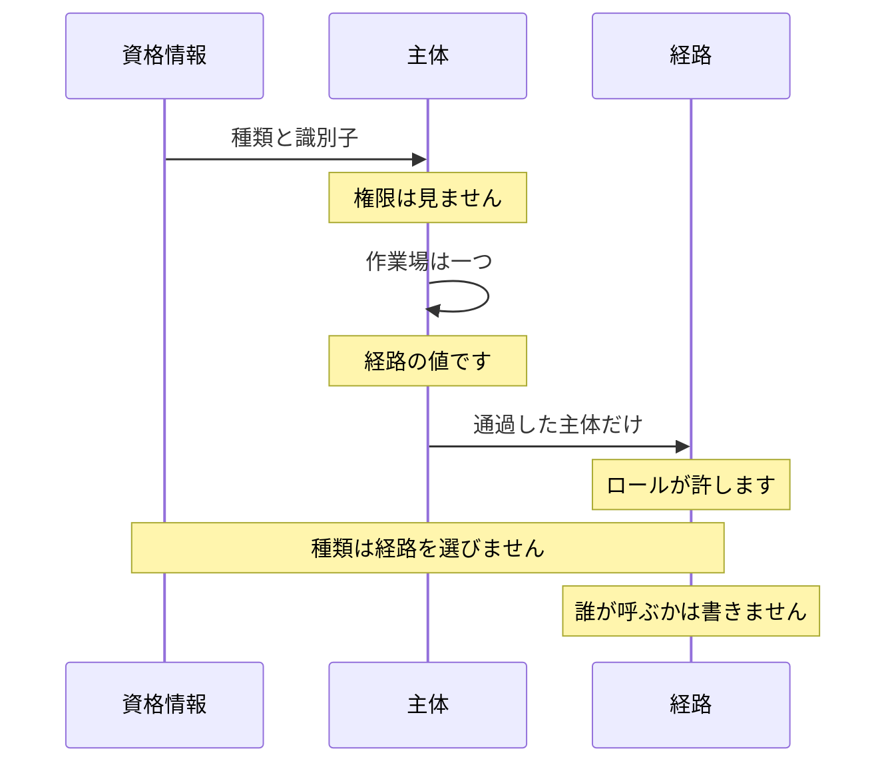
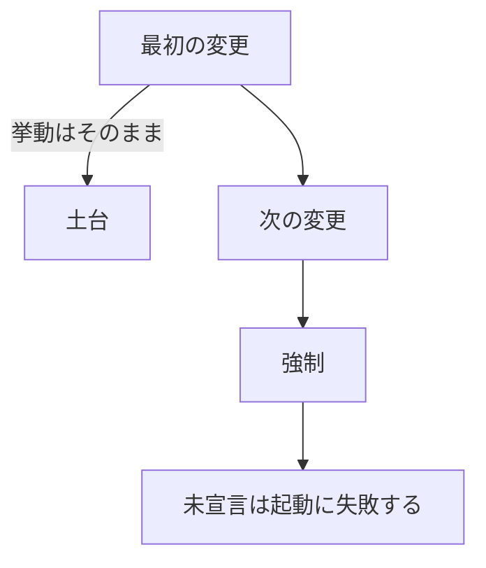

# 認証としてよいことを分ける

一人で、すべての経路を自分のセッションで叩くなら、認証できたことは、してよいことと同じに見えます。分かれ始めるのは、機械が自分の資格情報で同じ経路を叩き、人のセッションと機械の鍵が同じ入口に並ぶときです。認証は、誰であるかを決めます。認可は、その誰かが、この操作をしてよいかを決めます。経路の中でこの二つを同時に書くと、権限を足しただけで、それまで通っていた機械が通らなくなります。

この構成では、経路は必要な権限だけを宣言します。誰がそれを持つかは、ロールから導きます。人の鍵は、機械の資格にしません。土台を入れる変更と、強制を始める変更は、同じ変更にしません。

## 課題

知りたいことは、鍵が正しいかではありません。その鍵で、この操作をしてよいかです。

認証だけを見ている経路は、人のセッションも、機械の資格情報も、通ったあとに同じ扱いになります。してよいことの差は、経路ごとの分岐に散ります。ある経路は資格情報の種類で人だけを通し、別の経路は会員であることを見て、さらに別の経路は何も見ません。権限を一つ足すと、種類で弾いていた分岐と、権限で弾く分岐が同じ場所で動き、呼び出し側の失敗がどちらから来たかが消えます。

機械は、人の代理ではありません。人に許されている書き込みを、機械の鍵が持っているとは限りません。逆に、機械にだけ必要な、作業の取得や生存の報告を、人のセッションが持っている必要もありません。種類で「これは機械だから拒否」と書くと、その文は権限の表と二重になります。表を直しても、種類の分岐が古い答えを残します。

人の鍵を機械に置くと、別の問題になります。一台を失効させても、人の鍵が残ります。人のセッションを切ると、生きている機械まで止まります。機械の上にある鍵が、新しい機械を認める権限を持っていると、その機械が次の機械を自分で入れてしまいます。承認は、人が押す操作の側に残したいのです。

作業場の指定も、認証とは別の事実です。経路に含まれる作業場、資格情報に結び付いた作業場、依頼に添えた作業場が、同時に出てきます。どれか一つを黙って採用すると、認可は一方を見て、処理はもう一方の行を書きます。

未宣言の経路は、レビューの抜けとして残ります。一覧が頭の中にあるあいだは、新しい経路を足した人が宣言を忘れます。忘れることが起動の失敗にならないと、穴は次の変更まで見えません。

公開してよい経路もあります。署名の検証、短い同意の往復、生死の探査です。これを「認証が無い」とだけ記録すると、強制の側では開いているのに、外へ出す契約では鍵が要るように見えます。逆に、契約では開いているのに、実装は鍵を読んでいる、というのも残ります。どちらか一方の一覧では、もう一方の嘘を捕まえられません。

## 制約

この構成が置いた制約は、次のとおりです。

認証は、資格情報を主体に変えるところまでで終わります。主体は種類と識別子だけを持ちます。権限はこの段では見ません。人のセッションは人の主体になります。機械に発行した資格情報は、機械の主体になります。一つの操作だけを委譲する鍵は、その鍵自身を主体にします。

経路が宣言するのは、必要な権限だけです。誰が呼んでよいかは書きません。それを持つかは、ロールが権限を束ねた結果から計算します。人向けだと経路に書いた文は置きません。その文は、ロールを編集した瞬間に古くなります。

機械のロールは、人の権限を持ちません。新しい機械を認める権限は、人のロールにだけ置きます。機械の上に置いてある資格情報が、その承認を自分で通せるようにしません。一つの操作だけを渡す鍵には、広い書き込みを持たせません。広い権限を持たせて、経路ごとの依存が覚えているかどうかで境界を作ると、宣言の付け忘れが穴になります。

作業場が経路に含まれているなら、その値を権威にします。資格情報に結び付いた作業場や、依頼に添えた指定と食い違うときは拒否します。黙って片方を選びません。本体が別の作業場を名指しているときも拒否します。

評価は、許すものの和です。所属が無くても、明示の許可があれば通せる余地を残します。一つも許可が無いときが拒否です。評価の途中で起きた障害も拒否にします。障害を許可にしません。権限の結果はキャッシュしません。失効は、次の依頼から効きます。

人を外したとき、機械の権限が次の依頼から効かなくなるのは、鍵を共有しているからではありません。機械の主体が、所有者の生きている所属に結び付いているからです。結び付きは依頼のたびに見ます。後始末のジョブでは消しません。

強制を始める前に、すべての経路が、宣言、まだ古い認証のまま、どちらでもない、のどれかに分類できることです。どちらでもない経路は、公開すると決めて理由が書いてあるもの以外、置けません。古い認証のままの数は、減る一方にします。

クライアントは、ロールから権限を計算し直しません。サーバが返した、今効いている権限の集合だけを見ます。表示の出し分けは、強制ではありません。

## 採らなかった方式

### 資格情報の種類で経路を分ける

人のセッションなら通し、機械の鍵なら拒否する、という分岐を経路に置く方式です。認証と認可が同じ場所にあり、権限を変えると、通る資格情報の種類まで動きます。機械の鍵が一部の経路で急に通らなくなったのは、この融合の症状でした。拒否の理由は権限なのに、呼び出し側には認証の失敗に見えます。

この構成では、種類の判定は主体を作るところまでで終わります。その主体が操作をしてよいかは、ロールが持っている権限だけが決めます。機械が拒否されるのは、機械のロールがその権限を持たないからです。

### 人の鍵を機械の資格にする

人のセッションや、人が持つ鍵を、機械が提示する方式です。機械は人として認証されるので、人に許されていることが機械にも許されます。一台を失効させても同じ鍵が残ります。人のセッションを切ると、作業を受けている機械まで止まります。

機械の上の鍵が、新しい機械を認める権限を持っていると、侵害された一台が次の一台を入れます。承認は人の操作に残し、機械のロールからは外します。鍵の世代を回しても、許されていることの集合は動きません。人の鍵を回すのとは別の操作です。

一つの操作だけを委譲する鍵を、広い書き込み権限つきの人の鍵で代用する方式も採りませんでした。名義上は面の全体が開き、実際の境界は経路がどの依存を付けたかになります。狭いロールにしておけば、経路が権限を宣言するだけで届きません。

### 土台と強制を同じ変更にする

カタログ、ロール、評価、経路への宣言を入れたのと同時に、宣言の無い経路をすべて拒否し始める方式です。起動できない原因が、モデルの不備なのか、呼び出し側が権限を失ったのかが、同時に起きます。戻すときも、土台ごと戻るか、強制だけ戻るかが分けられません。

未宣言を一度に失敗へすると、移し忘れと、意図した拒否が同じ失敗になります。減る一方の期間が無いと、古い認証の経路を新しく足したことと、まだ移していないことが区別できません。

この構成では、最初の変更は土台だけです。既存の経路の挙動は変えません。古い認証のままの経路は数えて、その数が増える変更は受け付けません。次の変更で、宣言の無い経路と、古い認証のまま残った経路を、起動の失敗にします。ここで初めて、権限が拒否を始めます。

### してよいことを経路ごとに書き下ろす

「この経路は人だけ」「この経路は機械も可」と、到達できる主体を経路の横に書く方式です。ロールを編集しても、その文は自分では直りません。人にだけあった権限を機械のロールへ足したとき、機械の資格情報だけで作業場を特定できるようになる経路が出ます。依頼の形が変わります。導出していれば、ロールの編集が到達範囲と依頼の形を一緒に動かし、契約の差分として見えます。手書きの文は、その差分に出てきません。

### クライアントがロールを解釈する

操作する側がロールの名前を見て、操作の可否を自分で決める方式です。サーバの束ね方と、操作する側の束ね方がずれます。明示の許可は、ロールの名前だけでは見えません。操作する側が許可して、サーバが拒否する、で済めばまだ穴ではありません。逆は穴になります。

この構成では、操作する側はサーバが返した権限の集合だけを見ます。集合が古くても、サーバの拒否が残ります。表示の分岐は、その拒否を先に見せるためのものです。

## 採用した形

処理は四段に分けました。資格情報から主体を作ること、作業場を一つに決めること、主体と権限と作業場を評価すること、そして通過した主体だけを経路の処理に渡すことです。

依頼は資格情報として入り、その段を出るときは主体です。主体が持つのは、種類と識別子です。認証はそこで終わります。権限は見ません。次の段で作業場を一つに決め、使うのは経路の値です。評価は、ロールが許すものを尋ねます。通過した主体だけを、経路へ渡します。資格情報の種類は経路を選ばず、経路は誰が呼ぶかを書きません。

### 認証は主体まで

受け付ける資格情報は、ここで一度だけ種類を見ます。人のセッションは人になります。機械に発行した資格情報は、その機械の主体になります。鍵の世代は主体に結び、人のセッションとは別の秘密です。一つの操作だけを委譲する鍵は、鍵自体を主体にし、その鍵を捨てたときに委譲も死にます。

主体は小さいです。種類と識別子があれば、ロールを引く場所が決まります。拒否の記録も、成功した操作の記録も、この対を鍵にします。この段では権限を見ません。認証できたことは、まだ何も許していません。

### 経路は権限だけを宣言する

経路に書くのは、必要な権限です。宣言は依存として付き、起動時にすべての経路を歩きます。宣言が無い経路は、公開の理由が書いてあるもの以外、起動できません。同じ歩きを、変更の検証でも行います。忘れは、レビューの指摘ではなく、起動の失敗になります。

誰が持つかは、ロールの束ねから計算します。人のロールと機械のロールは別の束ねであり、機械の束ねに人の権限は入れません。人にだけあった権限を機械へ移すと、その権限を宣言している経路では、機械の資格情報が作業場を供給できるようになり、依頼の形が変わります。ロールの一行が、多くの経路の契約を動かします。だから契約の差分は、権限の編集と同じ変更で見ます。

作業場が経路に含まれている経路は、その値で認可します。別の指定と食い違えば拒否します。処理が書く行と、認可が見た作業場を、別の値にしません。

呼び出し側だけの経路、つまり作業場を持たず、本人の行だけに触る経路は、評価に入れません。閉じ込めは、処理の問い合わせが本人に限っていることだけになります。だから、なぜ作業場の権限ではないのかを、経路ごとに一文で残します。文が書けない経路は、作業場の権限が要ります。

鍵を要求しない経路は、二箇所で理由を残します。強制の側で、認証の依存が意図して無いこと。外へ出す契約の側で、鍵が要らないと見えること。片方だけでは、実装は開いているのに契約は鍵を要求する、または契約は開いているのに実装は鍵を読む、が残ります。理由の一覧は正確にします。使われなくなった文も、まだ要る文の欠落も、失敗にします。開くと決めること自体が、変更の本文に残る操作です。

### 評価はロールから導く

保存してあるのはロールの名前です。名前から権限への展開は、実行時の集合演算にします。許可の源は、人の所属、機械の主体を所有者の生きている所属に結んだもの、委譲の鍵を同じく結んだもの、明示の許可、です。和なので、所属が無い主体でも明示の許可は通せます。何も無ければ拒否します。

評価が投げた障害は、拒否と同じにします。保存が止まっているときに許可へ倒しません。結果は覚えません。所属を外した次の依頼から、機械も含めて効きます。

拒否と、成功した操作の記録は分けます。成功の記録は、処理が終わったと知っている側が書きます。依存は、処理が成功したかを知りません。拒否は、権限の拒否も、主体が作られる前の資格情報の問題も、同じ流れに載せます。一部の拒否だけを記録すると、集まって見える数が静かになり、静かなことが嘘になります。

オブジェクトの一行に触ってよいかは、ロールの外に残します。ロールが答えるのは、この種類の操作をしてよいかです。どの行かは、処理の問い合わせと、その行の所有です。権限を宣言しただけでは、識別子を知っている呼び出しが隣の行へ届くのを止められません。

### 強制は、土台の次の変更で始める

最初の変更は土台を入れ、それまでの挙動はそのままにします。強制が始まるのは、次の変更です。宣言の無い経路は、そこで起動に失敗します。

最初の変更で入るのは、権限のカタログ、ロール、評価、経路が宣言を付けられる依存、すべての経路を分類する歩き、です。既存の経路は、それまでの認証のまま動きます。挙動は変えません。古い認証のままの経路は数えます。その数が増える変更は受け付けません。減る一方にしておけば、新しい経路を古い認証で足したことが、数の差分で分かります。

次の変更で、古い認証の印を起動の失敗にします。宣言が無く、公開の理由も無い経路も失敗にします。移行の段ではなく、戻ったこと自体が退行になります。権限による拒否が始まるのは、この変更からです。

呼び出し側が作業場をどこから得ていたかは、宣言を足す前に見ます。経路に含まれているなら、それを権威にします。依頼の本体の欄だけが作業場を持っていた経路と、そもそも作業場が無く本人にだけ作用する経路は、宣言の足し方を変えないと、それまで通っていた依頼が、権限の中身とは別の理由で落ちます。落ちた理由が権限に見えると、ロールの編集に見えます。実際は、作業場の供給元を移しただけです。

## 何が解けるようになったか

認証できたことと、操作をしてよいことが、別の事実として残ります。機械の鍵が拒否されるのは、認証に失敗したからではなく、機械のロールがその権限を持たないからです。人のセッションが通る経路を、機械の鍵が種類の特例で通ることはありません。

経路を足したときに宣言を忘れると、起動しません。公開する経路は、強制と契約の両方に理由が要ります。どちらかが古いと、変更の検証が失敗します。

人の鍵を機械に置かないので、一台の失効が人のセッションを巻き込みません。人を外した次の依頼から機械も止まります。新しい機械を認める操作は、機械の上の鍵ではできません。一つの操作だけを渡した鍵は、その操作の権限しか持ちません。

作業場は、経路に含まれている値を権威にします。別の指定との食い違いは、黙って解消しません。

土台と強制を分けたので、モデルを入れた変更では呼び出し側の挙動が変わりません。強制を始めた変更では、未宣言と、古い認証の残りが、起動の失敗として見えます。ロールを編集すると、到達できる主体と、依頼の形は、手書きの一覧を直さなくても、同じ導出から変わります。

権限を経路の記憶に置いたままにすると、ロール、資格情報の種類、作業場の指定が、同じ分岐の上で同時に正しくいられなくなります。分けたのは、それぞれが古くなる条件が違うからです。
