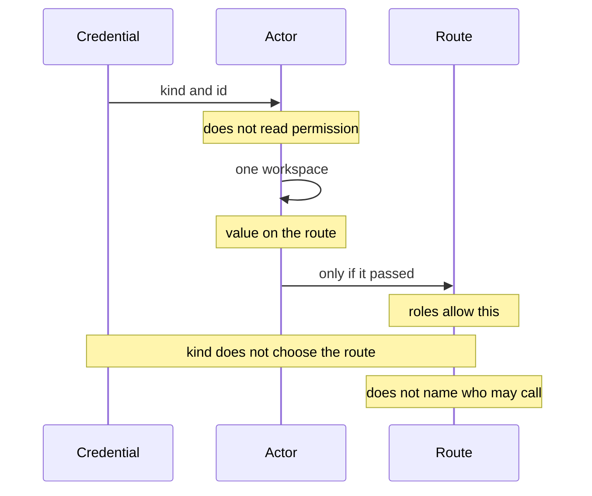
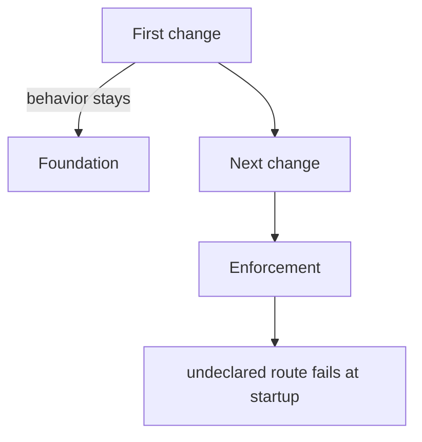

# Separate Authentication from What an Actor May Do

If one person hits every route with their own session, being authenticated looks the same as being allowed. They split when a machine hits the same route with its own credential, and a person's session and a machine key stand at the same entrance. Authentication decides who it is. Authorization decides whether that someone may perform this operation. Write both inside the route, and adding a permission is enough to stop a machine that used to pass.

In this design, a route declares only the permission it needs. Who holds it is derived from roles. A person's key is not a machine's credential. The change that installs the foundation, and the change that starts enforcement, are not the same change.

## The problem

The question is not whether the key is correct. It is whether this operation is allowed with that key.

A route that only looks at authentication treats a person's session and a machine credential the same once they have passed. The difference in what they may do is scattered across per-route branches. One route lets only a person through by the kind of credential. Another looks at membership. Another looks at nothing. Add one permission, and the branch that rejected by kind and the branch that rejects by permission move in the same place. The caller can no longer tell which one the failure came from.

A machine is not a person's stand-in. A write allowed for a person is not necessarily held by a machine key. The other way around, work pickup and a liveness report, which only a machine needs, do not need to be held by a person's session. Write "reject because this is a machine" by kind, and that sentence duplicates the permission table. Fix the table, and the kind branch keeps the old answer.

Putting a person's key on a machine is a different problem. Revoke one machine, and the person's key remains. Cut the person's session, and a live machine stops too. If the key on the machine holds the authority to admit a new machine, that machine admits the next one by itself. Approval should stay on the side a person presses.

Which workspace was named is also a fact separate from authentication. The workspace in the route, the workspace bound to the credential, and the workspace attached to the request can all appear at once. Silently adopt one of them, and authorization looks at one while processing writes the other row.

An undeclared route remains a hole in review. While the list lives in someone's head, the person who adds a new route forgets the declaration. If forgetting is not a startup failure, the hole stays invisible until the next change.

Some routes may be public. Signature verification, a short consent exchange, a liveness probe. Record that only as "there is no authentication," and the enforcement side is open while the contract published outward looks like it requires a key. The reverse remains too: the contract is open, and the implementation reads a key. A list on only one side cannot catch a lie on the other.

## Constraints

The constraints in this design are as follows.

Authentication ends once it has turned a credential into an actor. An actor holds only a kind and an identifier. Permission is not consulted at this stage. A person's session becomes a person actor. A credential issued to a machine becomes a machine actor. A key that delegates only one operation makes that key itself the actor.

What a route declares is only the permission it needs. It does not write who may call it. Whether someone holds it is computed from the result of roles bundling permissions. A sentence written on the route that says it is for people is not kept. That sentence goes stale the moment a role is edited.

A machine role does not hold a person's permissions. The authority to admit a new machine sits only on a person's role. A credential placed on a machine is not able to pass that approval by itself. A key that hands over only one operation is not given a broad write. Give it a broad permission, and make the boundary whether each route's dependency remembered to check, and a forgotten declaration becomes a hole.

If a workspace is included in the route, that value is authoritative. When it disagrees with the workspace bound to the credential, or with the one attached to the request, the request is refused. One side is not chosen silently. A body that names a different workspace is refused too.

Evaluation is the union of what is allowed. Even without a membership, an explicit grant can still pass. Refusal is when there is no grant at all. A fault during evaluation is also a refusal. A fault is not turned into a grant. The permission result is not cached. Revocation takes effect from the next request.

When a person is removed, a machine's permission stops taking effect from the next request not because the key is shared. It is because the machine actor is bound to the owner's live membership. The binding is read on every request. It is not cleared by a cleanup job.

Before enforcement starts, every route can be classified as declared, still on the old authentication, or neither. A route that is neither cannot exist unless it was decided to be public and a reason is written. The count of routes still on the old authentication only decreases.

A client does not recompute permissions from roles. It looks only at the set of permissions currently in effect that the server returned. Switching the display is not enforcement.

## Approaches this design rejects

### Splitting routes by the kind of credential

A branch on the route that lets a person's session through and rejects a machine key. Authentication and authorization sit in the same place, and changing a permission moves which kinds of credential pass. A machine key suddenly failing on some routes was a symptom of that fusion. The reason for refusal is a permission, and the caller sees an authentication failure.

In this design, judging the kind ends once the actor is created. Whether that actor may perform the operation is decided only by the permissions the role holds. A machine is refused because the machine role does not hold that permission.

### Making a person's key the machine's credential

The machine presents a person's session, or a key the person holds. The machine is authenticated as the person, so what is allowed for the person is allowed for the machine. Revoke one machine, and the same key remains. Cut the person's session, and a machine that is accepting work stops too.

If the key on the machine holds the authority to admit a new machine, one compromised machine admits the next. Approval stays on a person's action, and is removed from the machine role. Rotating a key generation does not move the set of what is allowed. It is a different operation from rotating a person's key.

Substituting a person's key that has a broad write for a key that delegates only one operation was also rejected. Nominally the whole surface is open, and the real boundary is which dependency the route attached. Keep the role narrow, and declaring the permission on the route is enough for it not to reach.

### Putting the foundation and enforcement in the same change

Starting to refuse every undeclared route at the same time the catalog, the roles, the evaluation, and the declarations on routes are introduced. The reason startup fails, a flaw in the model or a caller that lost a permission, happens at once. Rolling back cannot tell whether the foundation comes back or only enforcement does.

Sending every undeclared route to failure at once makes a forgotten migration and an intended refusal the same failure. Without a period where the count only decreases, adding a new route on the old authentication cannot be distinguished from a route that has not been moved yet.

In this design, the first change is only the foundation. Existing routes do not change behavior. Routes still on the old authentication are counted, and a change that increases that count is not accepted. The next change makes an undeclared route, and a route still on the old authentication, a startup failure. Permission starts refusing only from this change.

### Writing down what is allowed on each route

Writing next to the route "this route is people only" or "this route allows machines too." Edit a role, and that sentence does not fix itself. When a permission that only people had is added to a machine role, routes appear where a machine credential alone can identify a workspace. The shape of the request changes. If it is derived, editing the role moves the reachable set and the shape of the request together, and that shows up as a contract diff. A handwritten sentence does not appear in that diff.

### Letting the client interpret roles

The operating side looks at a role name and decides for itself whether an operation is allowed. The server's bundling and the operating side's bundling drift. An explicit grant is not visible from a role name alone. If the operating side allows and the server refuses, that is not yet a hole. The reverse is a hole.

In this design, the operating side looks only at the permission set the server returned. Even if the set is stale, the server's refusal remains. A display branch exists to show that refusal first.

## The shape that was adopted

Processing is split into four stages. Create an actor from a credential. Settle on one workspace. Evaluate the actor, the permission, and the workspace. Hand only an actor that passed to the route's processing.

A request enters as a credential and leaves that step as an actor, carrying a kind and an identifier. Authentication stops there. It does not read a permission. The next step settles one workspace, using the value on the route. Evaluation asks what the roles allow. Only an actor that passed is handed to the route. The kind of credential does not choose the route, and the route does not name who may call it.

### Authentication goes as far as the actor

The credentials that are accepted look at kind only once, here. A person's session becomes a person. A credential issued to a machine becomes that machine's actor. A key generation is bound to the actor, and it is a secret separate from a person's session. A key that delegates only one operation makes the key itself the actor, and the delegation dies when that key is discarded.

An actor is small. A kind and an identifier are enough to decide where to look up the role. Records of refusal, and records of a successful operation, are keyed by that pair. This stage does not look at permission. Being authenticated has not allowed anything yet.

### A route declares only a permission

What is written on a route is the permission it needs. The declaration is attached as a dependency, and startup walks every route. A route with no declaration cannot start unless a reason for being public is written. The same walk runs when a change is verified. Forgetting is a startup failure, not a review comment.

Who holds it is computed from the role bundle. A person's role and a machine's role are different bundles, and a person's permission is not placed in the machine bundle. Move a permission that only people had onto a machine, and on a route that declares that permission a machine credential becomes able to supply the workspace, and the shape of the request changes. One line of a role moves the contract of many routes. That is why a contract diff is seen in the same change as the permission edit.

A route that includes a workspace authorizes with that value. A disagreement with another naming is a refusal. The row processing writes, and the workspace authorization saw, are not different values.

A caller-only route, one that has no workspace and touches only the caller's own row, is not put into evaluation. Confinement is only that the processing query is limited to that person. So each such route keeps one sentence on why it is not a workspace permission. A route that cannot write that sentence needs the workspace permission.

A route that does not require a key keeps a reason in two places. On the enforcement side, that the authentication dependency is intentionally absent. On the contract published outward, that it is visible that no key is required. With only one side, either the implementation is open while the contract requires a key, or the contract is open while the implementation reads a key. The list of reasons is kept exact. A sentence that is no longer used, and a missing sentence that is still needed, are both failures. Deciding to open a route is itself an operation that remains in the body of the change.

### Evaluation is derived from roles

What is stored is the name of a role. Expanding a name into permissions is a set operation at runtime. The sources of a grant are a person's membership, a machine actor bound to the owner's live membership, a delegated key bound the same way, and an explicit grant. Because it is a union, an actor with no membership can still pass on an explicit grant. If there is nothing, it is a refusal.

A fault thrown by evaluation is treated the same as a refusal. When storage is down, it does not fall through to a grant. The result is not remembered. It takes effect, including for machines, from the next request after a membership is removed.

Refusal, and the record of a successful operation, are kept apart. The success record is written by the side that knows processing finished. The dependency does not know whether processing succeeded. Refusal puts both a permission refusal and a credential problem from before an actor is created on the same stream. Record only some refusals, and the count that gathers into view goes quiet, and the quiet is a lie.

Whether a particular object row may be touched stays outside the role. What a role answers is whether this kind of operation is allowed. Which row is the processing query and the ownership of that row. Declaring a permission alone does not stop a caller who knows an identifier from reaching the neighboring row.

### Enforcement starts in the change after the foundation

The first change installs the foundation and leaves existing behavior in place. The next change is the one that starts enforcement. An undeclared route then fails at startup.

The first change brings in the permission catalog, the roles, the evaluation, a dependency that lets a route attach a declaration, and a walk that classifies every route. Existing routes keep running on the authentication they had. Behavior does not change. Routes still on the old authentication are counted. A change that increases that count is not accepted. If the count only decreases, adding a new route on the old authentication shows up as a difference in the count.

The next change makes the mark of the old authentication a startup failure. A route with no declaration and no reason for being public fails too. It is not a migration stage. Coming back is itself a regression. Refusal by permission starts from this change.

Where the caller used to obtain the workspace is looked at before the declaration is added. If it is included in the route, that becomes authoritative. A route whose only workspace was a field on the request body, and a route that had no workspace and acted only on the person, will drop requests that used to pass for a reason other than the permission itself, unless the way the declaration is added is changed. If the reason for the drop looks like a permission, it looks like a role edit. In fact only the source that supplies the workspace was moved.

## What this makes possible

Being authenticated, and being allowed to perform an operation, remain different facts. A machine key is refused not because authentication failed, but because the machine role does not hold that permission. A route a person's session passes is not passed by a machine key as a special case of kind.

Forget the declaration when adding a route, and it does not start. A public route needs a reason on both enforcement and the contract. If either is stale, verification of the change fails.

A person's key is not placed on a machine, so revoking one machine does not drag in the person's session. From the next request after the person is removed, the machine stops too. Admitting a new machine cannot be done with a key that sits on a machine. A key that was given only one operation holds only that operation's permission.

The workspace uses the value included in the route as authoritative. A disagreement with another naming is not resolved silently.

Because the foundation and enforcement were split, a change that installs the model does not change caller behavior. In the change that starts enforcement, an undeclared route and what remains of the old authentication are visible as startup failures. Edit a role, and the actors that can reach, and the shape of the request, change from the same derivation without editing a handwritten list.

Leave permission as something the route remembers, and roles, the kind of credential, and which workspace was named cannot all stay correct on the same branch at once. They were split because each one goes stale under a different condition.
