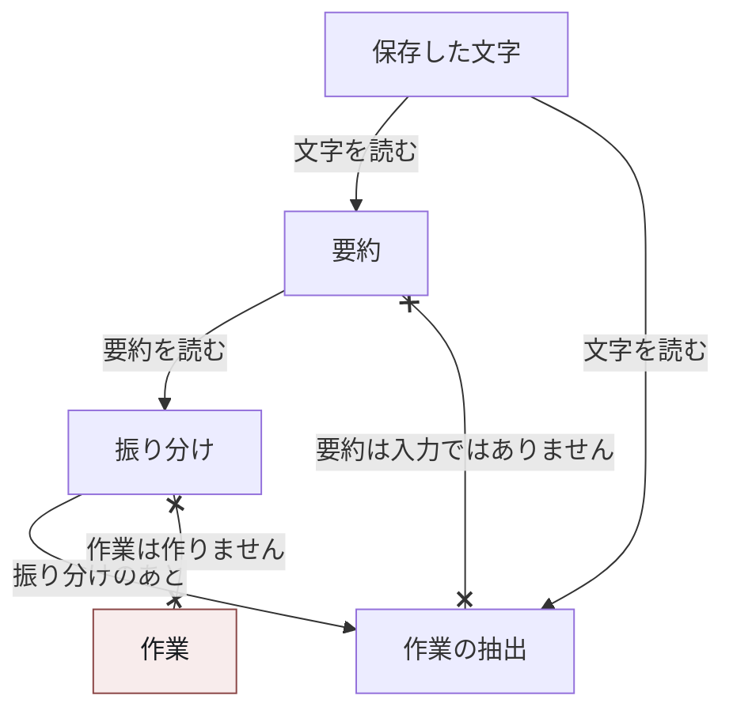
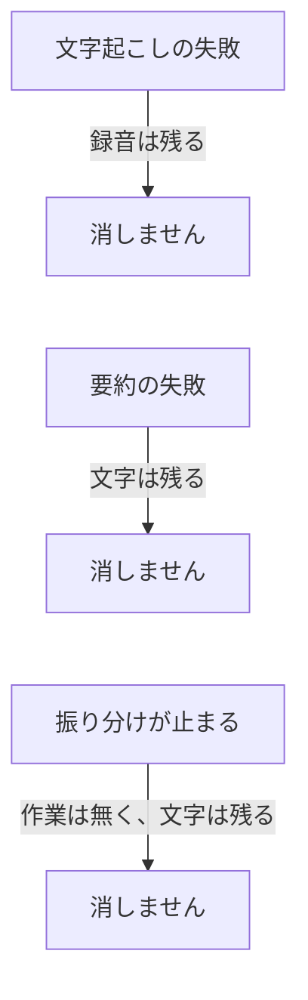

# 発話の流れを、作業にしない

短い依頼を一文で受け取れるなら、発話と作業は同じものに見えます。誰かが「これをやって」と言い、その文が作業になります。困り始めるのは、会議です。一時間の発話のほとんどは作業ではありません。状況の共有、相槌、寄り道、決めたことの確認、何も決めずに棚上げした話題が、同じ列に並びます。その列を作業の一覧だと読むと、雑談が作業になり、引き受けが雑談に埋もれます。

この構成では、発話の流れを作業にしません。文字起こし、要約、作業の抽出は、成功も失敗も共有しない別の段階にします。相対的な期日は、処理が走った日ではなく、会議の時刻から解きます。録画の持ち主は、録音を始めたアカウントです。発話から作業を起こすかどうかは、そのアカウントとは別の判断にします。

## 課題

会議が終わった瞬間に、言葉はまだありません。録音の完了と、文字の完了は別の出来事です。文字は遅れ、失敗し、空の参加だけで終わることもあります。文字が無い状態を作業の不在と読むと、認識の失敗が「何も決まらなかった」になります。

文字が届いても、それは作業ではありません。決定、引き受け、懸念、未解決の問い、ただの経過が混ざります。モデルに「この文字から作業を作れ」とだけ渡すと、報告まで作業になり、逆に根拠の弱い文を落としすぎると、明示の引き受けまで落ちます。

期日は発話の中では相対です。「金曜」「明日」「来週のはじめ」。文字起こしと抽出は会議のあとで、日付をまたぎます。処理が走った日を今日にすると、翌朝の再試行だけで一日ずれます。サーバがいる地域の今日に固定すると、会議がその地域の外で行われたとき、暦の日がずれます。

録画には持ち主がいます。人が手元で録ったものは、最初はその人のものです。作業場へ共有される前に、作業場の判断を走らせると、私有の録音が他人の作業になります。共有のあとでも、誰が録ったかと、どの文を作業にするかは別です。話者の名前がメンバーに解けないことを理由に引き受けを捨てると、作業場の外にいる人の「やります」が消えます。名簿に写った自動記録の主体を人だと読むと、持ち主や作業場を取り違えます。

要約を作業リストにすると、別の失敗が重なります。要約は短いです。失敗します。短い会議では作りません。要約の欠落が、作業の欠落になります。要約が言い換えた文を根拠にすると、録音にあった引き受けが、一致しない引用として捨てられます。

## 制約

この構成が置いた制約は、次のとおりです。

録音が終わった処理は、文字起こしを依頼して終わります。文字の中身を待ちません。文字起こしの失敗は、録音の行を消しません。

文字は、先に保存します。保存が済むまで、要約も作業の抽出も走りません。要約の失敗は、保存した文字を消しません。短すぎて要約を作らない判断も、文字の破棄ではありません。

作業の抽出は、保存した文字を読みます。要約だけを読んで、作業の中身を確定しません。どの作業場が後で文字を読むかを決める安い判断は、要約を見てよいです。その判断は、作業を作りません。

相対的な期日の基準は、会議の時刻です。処理を実行した時刻でも、固定の地域の今日でもありません。暦の日が要るときは、その時刻を作業場の地域で読みます。

録画の持ち主は、録音を始めたアカウントです。話者の推定、名簿の表示名、自動記録の主体から導きません。持ち主が作業場へ共有するまで、作業場に対する要約と作業の判断は走りません。文字起こし自体は、私有のままで完了してよいです。共有された瞬間に、同じ文字へ、共有先の判断を足します。

話者が作業場のメンバーに解けないことは、作業を起こさない理由にしません。担当が空の作業は正しく、作業が無いことは正しくありません。自動記録の主体は参加者名簿から除きます。人でも持ち主でもありません。

抽出が根拠として残す引用は、保存した文字に対するものです。モデルが清書した本文を正にしません。長い会議は切りません。次の手は、末尾に寄ります。

## 採らなかった方式

### 一つの呼び出しにまとめる

文字起こし、要約、作業の抽出を、同じ成功で終える方式です。認識が遅いと作業が無く、要約が失敗すると文字まで失敗に見え、抽出が拒否すると録音が無かったことになります。三つの失敗は、外から直す場所が違います。この構成では、録音の完了、文字の保存、要約、作業の抽出を、別の段階にしました。

### 文字を清書してから抽出する

フィラーを落とす、音声認識の誤りを直す、長い文字を窓に切って言い換える、という前処理です。抽出は渡された文を引用します。その文がモデルの言い換えだと、引用が録音と一致しません。一致しない引用は根拠なしになり、実際の引き受けが捨てられます。名前を直す仕事は、会議全体が見えている抽出の側に残しました。前処理がしてよいのは、話者の印で区切る、連続する行を繋ぐ、空白を揃える、中身の無い行を落とす、までです。発話は書き換えません。何が雑談かは、言語ごとの感動詞の一覧では決めません。一つの言語の相槌だけを落とすと、別の言語の相槌が残ります。

### 要約を作業リストにする

要約は、人が読むための短い記録です。決定、引き受け、懸念、未解決が、数個の文に畳まれます。これを作業の生成だとみなすと、畳み損ねが作業の却下になります。逆に、要約が作業の形をしていない文まで作業にすると、状況報告が作業になります。

どの作業場が後で読むかの判断まで文字全体を渡す方式も採りませんでした。その判断が重いと、何も起きなかった会議まで、作業の抽出と同じコストになります。安い判断は要約を読み、見る価値が無いと言えます。作業の中身は、起こされた側が文字全体を読んで決めます。

### 文字を汎用の出来事列へ流して、そこで作業を起こす

文字起こしの完了を、他のメッセージと同じ列に入れ、その還元で作業を作る方式です。列は「何かが記録された」を運びます。引き受けの判断ではありません。他の種類の出来事と混ざると、期日の基準が会議の時刻から離れ、処理が走った日や、列の中の別の時計になります。この構成では、文字の存在を記録することと、作業を起こすことを分けました。抽出は、その会議の時刻と、保存した文字を持って行います。

### 期日を処理時刻で解く

「明日」を、抽出が走った日の翌日にする方式です。文字起こしは遅れ、失敗した段階は再試行します。会議の翌朝に走っただけで、相対的な期日が一日ずれます。サーバの地域の今日に固定する方式も、同じ種類のずれを地域の差として起こします。基準にする時刻は、会議の時刻だけです。

### 話者の解決で、作業を起こすかを決める

名簿の名前と発話の名前が一致した人だけを作業にし、解けない話者の引き受けは外部だから捨てる、という方式です。一致は揺れます。部分一致を外して完全一致にすると、解けない話者が常態になります。その状態で捨てる規則を残すと、明示の引き受けが残らなくなります。担当を特定できないことは、未割当で残す理由です。作業を作らない理由ではありません。

持ち主を名簿から推定する方式も採りませんでした。自動記録の表示名が名簿に入ると、その名前が作業場や持ち主に見えます。持ち主は、録音を始めたアカウントとして、話者の解決とは別に渡します。

## 採用した形

段階は四つに分けました。文字の保存、要約、どの作業場が読むかの振り分け、文字を読んでの作業の抽出、です。

保存した文字が、あとの段階が読む元です。要約はその文字を読み、振り分けは要約を読みます。振り分けから作業を作る矢印はありません。作業の抽出が読むのは保存した文字であり、要約ではありません。抽出は、振り分けのあとに走ります。

文字起こしが失敗しても、録音の行は消えません。要約が失敗しても、保存した文字は消えません。振り分けが止まっても、作業は作られず、文字は残ります。

### 文字は、先に保存する

録音の完了は、文字起こしの依頼です。文字が届いた処理は、まず文字を保存します。私有の録音で、作業場がまだ無いなら、そこで止まります。要約も、作業の判断も、作業場の中身です。持ち主が共有したときに、同じ保存済みの文字へ、その判断を足します。共有の前に文字起こしが終わっていても、やり直しません。

一本のマイクで録ったものは、話者が一人に見えます。話者の切り分けは、要約の前の別の試みにします。失敗しても、文字は届いたときのまま残します。切り分けが推定で書いた名前を、事実の名簿にはしません。

会議の名簿と、会議の中で交わされた短い文は、文字の行に添えて残します。要約も、後の抽出も、同じものを読みます。処理が終わったあとに、別の取得へ依存しません。自動記録の主体は、この名簿に入れません。

### 要約は、読むための別段階

要約は、保存した文字に対する別のモデル呼び出しです。短すぎる文字には作りません。失敗しても、文字の保存は戻しません。人が後から読む概観であり、作業の行ではありません。

出力の言語は、作業場が読む言語に合わせます。文字そのものを扱う段階は、会議の言語を保ちます。要約の指示に「読め」と「訳せ」を同時に書くと、引用の元になる文字まで訳されます。

題名が機械的な仮の名前のときだけ、要約が提案した題名を採用します。人が付けた題名は、要約が取り消しません。

### 作業場への振り分けは、作業を作らない

文字が作業場に属したあと、どの作業場が後で読むかと、いつ読むかを決めます。入力は要約です。文字全体ではありません。見る価値が無い、と言えます。状況の共有だけで、誰も何も引き受けていない会議は、ここで止めてよいです。迷ったときに今すぐ見るのは、この振り分けの側の規則です。作業を何件作るかの規則ではありません。

この振り分けが失敗しても、文字は残ります。再試行は、同じ文字に対して同じ判断を重ねません。入力が変わったときだけ、やり直します。

### 作業は、文字を読み、会議の時刻で期日を解く

作業の抽出は、振り分けのあとで、保存した文字全体を読みます。要約の文を作業に転写しません。根拠の引用は、保存した文字に一致するものだけを残します。末尾は切りません。

相対的な期日は、会議の時刻を今日の位置にして解きます。「金曜」は、処理日の次の金曜ではなく、その会議から見た金曜です。暦の日へ落とすときは、作業場の地域でその時刻を読みます。明示が無ければ、期日は空のまま残します。推測で日付を埋めません。

作成するか、既存の作業を更新するか、何もしないかは、この抽出の出力です。文字起こしの成功は、そのどれでもありません。話者がメンバーに解けなければ、担当は空にします。行は残します。

録画の持ち主は、この判断の入力です。録音を始めたアカウントを、確定した値として渡します。話者の解決結果で上書きしません。持ち主であることは、その人の発話を全部作業にすることではありません。

## 何が解けるようになったか

録音が終わったこと、文字が残ったこと、人が読める要約があること、作業が起きたことは、別々に見られます。認識が遅れても、要約が失敗しても、文字は残ります。作業を起こさない判断は、録音が無かったことにはなりません。

「明日」は、抽出が走った日に引きずられません。会議の時刻が基準なので、再試行が翌朝でも、相対的な期日の位置は変わりません。

手元の録音は、持ち主が共有するまで作業場の判断を受けません。共有したあとは、同じ文字から作業を起こせます。誰が録ったかはアカウントで残り、どの文を作業にするかは別の判断で残ります。名簿に解けない話者の引き受けは、担当が空の作業として残せます。自動記録の主体は、持ち主にも担当にもなりません。

発話の流れを一つの処理で作業にすると、認識の遅れ、要約の短さ、期日の相対性、持ち主の強さが、同じ成功条件の上に載ります。分けたのは、それぞれが失敗する条件が違うからです。
