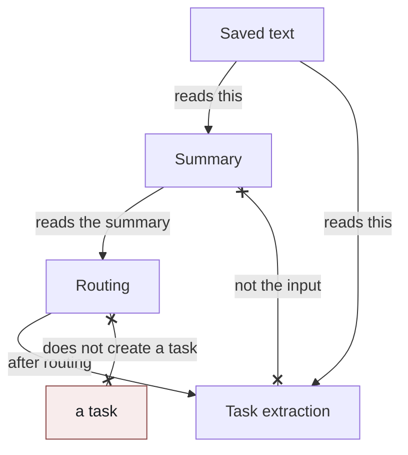
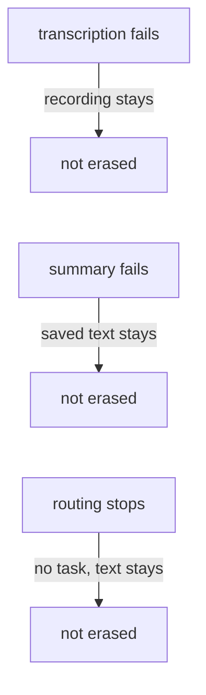

# A Transcript Is Not a Task List

If a short request arrives as one sentence, speech and a task look like the same thing. Someone says "do this," and that sentence becomes the task. The trouble starts in a meeting. Most of an hour of speech is not a task. Status, backchannels, digressions, confirmation of something already decided, and topics that were shelved without a decision all sit in the same stream. Read that stream as a task list, and small talk becomes work, while a real commitment disappears into the small talk.

This design does not turn the stream of speech into tasks. Transcription, summary, and task extraction are separate stages. They do not share success, and they do not share failure. A relative due date is resolved from the meeting's time, not from the day the processing ran. The owner of the recording is the account that started it. Whether speech becomes a task is a decision separate from that account.

## The problem

The moment a meeting ends, the words are not there yet. The recording finishing, and the text finishing, are different events. The text is late, it fails, and sometimes it ends as an empty attendance. Read a missing text as an absence of tasks, and a recognition failure becomes "nothing was decided."

Even when the text arrives, it is not a task. Decisions, commitments, concerns, open questions, and plain narration are mixed together. Hand a model only "make tasks from this text," and a status report becomes a task. Drop weak sentences too aggressively, and an explicit commitment drops with them.

Due dates inside speech are relative. "Friday." "Tomorrow." "Early next week." Transcription and extraction happen after the meeting, and they cross a calendar day. Treat the day the processing ran as today, and a retry the next morning shifts the date by one day. Pin today to the region where the server sits, and a meeting held outside that region shifts the calendar day.

A recording has an owner. Something a person recorded locally is theirs at first. Run a workspace's judgment before it is shared into that workspace, and a private recording becomes someone else's task. Even after it is shared, who recorded it and which sentence becomes a task are different facts. Drop a commitment because the speaker's name does not resolve to a member, and a "I'll do it" from someone outside the workspace disappears. Read an automatic recorder that was copied onto the roster as a person, and you mistake the owner or the workspace.

Turning the summary into the task list stacks a different failure. A summary is short. It fails. A short meeting does not get one. A missing summary becomes a missing task. Use a sentence the summary paraphrased as evidence, and a commitment that was in the recording is discarded as a citation that does not match.

## Constraints

The constraints in this design are as follows.

The processing that runs when a recording ends requests transcription and stops. It does not wait for the text. A transcription failure does not delete the recording's row.

The text is saved first. Until that save finishes, neither the summary nor task extraction runs. A summary failure does not delete the saved text. Deciding not to summarize because the text is too short is not discarding the text.

Task extraction reads the saved text. It does not settle the contents of a task by reading only the summary. A cheap decision about which workspace will read the text later may look at the summary. That decision does not create a task.

The reference for a relative due date is the meeting's time. It is not the time the processing ran, and it is not today in a fixed region. When a calendar day is required, that time is read in the workspace's region.

The owner of the recording is the account that started it. It is not derived from speaker estimates, display names on the roster, or the automatic recorder. Until the owner shares it into a workspace, summary and task judgment for that workspace do not run. Transcription itself may finish while the recording is still private. The moment it is shared, the destination's judgment is added to the same text.

A speaker who does not resolve to a workspace member is not a reason to skip creating a task. A task with an empty assignee is correct. Having no task is not. The automatic recorder is removed from the participant roster. It is neither a person nor the owner.

A citation kept as evidence is against the saved text. A body the model cleaned up is not the source of truth. A long meeting is not cut. The next step leans on the tail.

## Approaches this design rejects

### One call for all of it

Finishing transcription, summary, and task extraction on the same success. Slow recognition means no tasks. A failed summary makes the text look failed. A refused extraction makes the recording look as if it never existed. The three failures are fixed in different places from the outside. This design made the recording's completion, saving the text, the summary, and task extraction separate stages.

### Cleaning the text before extraction

Dropping fillers, correcting recognition errors, or cutting a long text into windows and paraphrasing it. Extraction cites the sentences it was given. If those sentences are the model's paraphrase, the citation does not match the recording. A citation that does not match is no evidence, and the actual commitment is discarded. Fixing names stays on the extraction side, which can see the whole meeting. Preprocessing may split on speaker marks, join consecutive lines, normalize whitespace, and drop empty lines. It does not rewrite speech. What counts as small talk is not decided by a list of interjections per language. Drop only one language's backchannels, and another language's backchannels remain.

### Making the summary the task list

A summary is a short record for a person to read. Decisions, commitments, concerns, and open questions are folded into a few sentences. Treat that as task generation, and a bad fold becomes a rejected task. The other way around, turning sentences that are not shaped like tasks into tasks, makes a status report into work.

Passing the whole text into the decision about which workspace reads it later was also rejected. If that decision is expensive, a meeting where nothing happened costs the same as task extraction. The cheap decision reads the summary and is allowed to say there is nothing worth looking at. The contents of a task are decided by the side that was woken up, and it reads the whole text.

### Pouring the text into a generic event stream and creating tasks there

Putting transcription-complete into the same stream as other messages, and creating tasks in the reduction of that stream. The stream carries "something was recorded." It is not a judgment of commitment. Mix it with other kinds of events, and the due-date reference leaves the meeting's time and becomes the day processing ran, or some other clock inside the stream. This design separates recording that the text exists from creating a task. Extraction runs with that meeting's time and the saved text.

### Resolving due dates from processing time

Making "tomorrow" the day after the day extraction ran. Transcription is late, and a failed stage is retried. Running the morning after the meeting is enough to shift a relative due date by one day. Pinning today to the server's region causes the same kind of shift as a difference of region. The only time used as the reference is the meeting's time.

### Letting speaker resolution decide whether a task is created

Making a task only for people whose roster name matches the name in the speech, and discarding an unresolved speaker's commitment because they are external. Matching is unstable. Remove partial matches and require an exact match, and unresolved speakers become the normal case. Leave a discard rule in that state, and explicit commitments stop remaining. Not being able to name an assignee is a reason to leave the task unassigned. It is not a reason to skip creating the task.

Estimating the owner from the roster was also rejected. If the automatic recorder's display name is on the roster, that name looks like the workspace or the owner. The owner is passed as the account that started the recording, separately from speaker resolution.

## The shape that was adopted

The stages are four. Saving the text, the summary, routing which workspace reads it, and extracting tasks by reading the text.

The saved text is the source both later stages read. The summary reads it, and routing reads the summary. Routing has no arrow that creates a task. Task extraction reads the saved text, not the summary, and it runs after routing.

A failed transcription does not delete the recording. A failed summary does not delete the saved text. When routing stops, it does not create a task, and the text remains.

### Save the text first

A finished recording is a request for transcription. The processing that receives the text saves the text first. If the recording is private and there is no workspace yet, it stops there. The summary and the task judgment are contents of a workspace. When the owner shares it, that judgment is added to the same already-saved text. If transcription finished before the share, it is not redone.

A recording from a single microphone looks like one speaker. Splitting speakers is a separate attempt before the summary. If it fails, the text remains as it arrived. A name the split wrote as an estimate is not put on the factual roster.

The meeting roster, and the short sentences exchanged during the meeting, stay attached to the text's row. The summary and the later extraction read the same material. After processing finishes, it does not depend on another fetch. The automatic recorder is not placed on this roster.

### The summary is a separate stage for reading

The summary is a separate model call over the saved text. Text that is too short does not get one. A failure does not roll back the saved text. It is an overview a person reads later. It is not a task row.

The output language matches the language the workspace reads. The stage that handles the text itself keeps the meeting's language. Write "read" and "translate" into the same summary instruction, and the text that citations come from gets translated too.

A title proposed by the summary is adopted only when the current title is a mechanical placeholder. A title a person set is not undone by the summary.

### Routing to a workspace does not create a task

After the text belongs to a workspace, the design decides which workspace reads it later, and when. The input is the summary. It is not the whole text. It is allowed to say there is nothing worth looking at. A meeting that only shared status, where nobody committed to anything, may stop here. Looking immediately when unsure is a rule of this routing. It is not a rule about how many tasks to create.

If this routing fails, the text remains. A retry does not stack the same judgment on the same text. It runs again only when the input changed.

### A task reads the text, and resolves dates from the meeting's time

Task extraction, after routing, reads the whole saved text. It does not transcribe summary sentences into tasks. A citation kept as evidence is only one that matches the saved text. The tail is not cut.

A relative due date is resolved with the meeting's time in the position of today. "Friday" is the Friday as seen from that meeting, not the next Friday after the processing day. When it is dropped onto a calendar day, that time is read in the workspace's region. If nothing was explicit, the due date stays empty. A date is not filled in by guessing.

Whether to create, update an existing task, or do nothing is an output of this extraction. A successful transcription is none of those. If the speaker does not resolve to a member, the assignee is left empty. The row remains.

The owner of the recording is an input to this judgment. The account that started the recording is passed as a settled value. It is not overwritten by the result of speaker resolution. Being the owner does not turn all of that person's speech into tasks.

## What this makes possible

That the recording ended, that the text remains, that a person can read a summary, and that a task was created, can be seen separately. The text remains even if recognition is late and even if the summary fails. A decision not to create a task is not the same as the recording never having existed.

"Tomorrow" is not dragged along by the day extraction ran. The meeting's time is the reference, so a retry the next morning does not move a relative due date.

A local recording does not receive a workspace's judgment until the owner shares it. After it is shared, tasks can be created from the same text. Who recorded it remains as the account. Which sentence becomes a task remains as a separate judgment. A commitment from a speaker who does not resolve on the roster can remain as a task with an empty assignee. The automatic recorder becomes neither the owner nor the assignee.

Turn the stream of speech into tasks in one processing step, and late recognition, a short summary, relative due dates, and the strength of ownership all sit on the same success condition. They were split because each one fails under a different condition.
